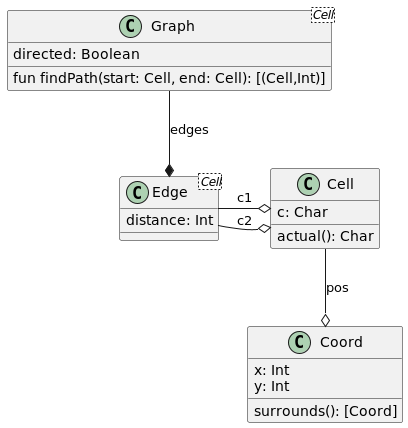

== Hill Climbing Algorithm

Today's puzzle required graph traversal. I decided to use link:https://github.com/corneil/aoc-2022-in-kotlin/tree/main/src/main/kotlin/utils[utilities] I created during the 2019 edition of Aoc.

The problem used a grid of letter to describe a map. Each letter describes an elevation starting at `a` as the lowest and `z` the highest.
The user may only navigate horizontally or vertically and only to one step higher, the same level, or lower by any amount. (You may jump off a cliff!)

[source,text]
....
Sabqponm
abcryxxl
accszExk
acctuvwj
abdefghi
....

=== Model

The Graph requires a list of Edges. Each of the edges must contain two Comparable items that are linked with a distance.
In our case the distance is always one and since you can go from low to only one step higher but jump off a cliff the graph will be directed and the distance between cells will always be 1.

The Graph uses the Dijkstra algorithm to find the shortest path between nodes.

[source,kotlin]
....
data class Cell(
  val c: Char,
  val pos: Coord
) : Comparable<Cell> {
  override fun compareTo(other: Cell): Int {
    var result = c.compareTo(other.c)
    if (result == 0) {
      result = pos.compareTo(other.pos)
    }
    return result
  }
  override fun equals(other: Any?): Boolean {
    if (this === other) return true
    other as Cell
    if (c != other.c) return false
    if (pos != other.pos) return false
    return true
  }
  override fun hashCode(): Int {
    return pos.hashCode() * c.hashCode()
  }
  fun actual(): Char = when (c) {
    'S' -> 'a'
    'E' -> 'z'
    else -> c
  }
  override fun toString(): String {
    return "Cell($c, $pos)"
  }
}

....

=== Parsing

The parsing of the grid and creating of Cells and Edges will be in one function.

[source,kotlin]
....
fun createGrid(input: List<String>): List<Edge<Cell>> {
  val edges = mutableListOf<Edge<Cell>>()
  val cells = input.mapIndexed { y, line ->
    line.mapIndexed { x, c ->
      Cell(c, Coord(x, input.lastIndex - y))
    }
  }.flatMap { row -> row.map { it } }.associateBy { it.pos }
  cells.values.forEach { cell ->
    cell.pos.surrounds().forEach { coord ->
      val neighbour = cells[coord]
      if (neighbour != null) {  // <1>
        val height = neighbour.actual() - cell.actual()
        if (height <= 1) { // <2>
          edges.add(Edge(cell, neighbour))
        }
      }
    }
  }
  return edges
}
....
<1> If there is no neighbour at the surrounding coordinates it will be skipped. This will happen for the cells on the edges of the grid.
<2> We are interested in cells that are 1 step higher or lower.

=== Processing

[source,kotlin]
....
fun calculateSteps(
  edges: List<Edge<Cell>>,
  start: Cell,
  end: Cell
): Int? {
  val graph = Graph(edges, true)
  val path = graph.findPath(start, end)
  return if (path.isEmpty()) null else path.size - 1 // <1>
}
....
<1> The path includes the start and end node and we will subtract 1 from the path length to obtain the number of steps. Null is returned for an empty path.

=== Part 1

In part 1 we had to find the shortest path between `S` (which is the same as `a`) and `E` (which is the same elevation as `z`).

[source,kotlin]
....
fun calcSolution1(input: List<String>): Int {
  val edges = createGrid(input)
  val end = edges.map { edge -> edge.c2 }
    .find { it.c == 'E' } ?: error("Cannot find E")
  val start = edges.map { edge -> edge.c1 }
    .find { it.c == 'S' } ?: error("Cannot find S")
  return calculateSteps(edges, start, end)
    ?: error("Cannot find solution from $start to $end")
}
....

=== Part 2

In part 2 we had to find the shortest paths for all cells labelled `a` and report the shortest of those.

[source,kotlin]
....
fun calcSolution2(input: List<String>): Int {
  val edges = createGrid(input)
  val end = edges.map { edge -> edge.c2 }
    .find { it.c == 'E' } ?: error("Cannot find E")
  return edges.map { edge -> edge.c1 }
    .filter { it.actual() == 'a' }
    .mapNotNull { start -> calculateSteps(edges, start, end) }
    .min()
}
....

=== Full source

[source,kotlin]
....
include::src/solution.kt[]
....
